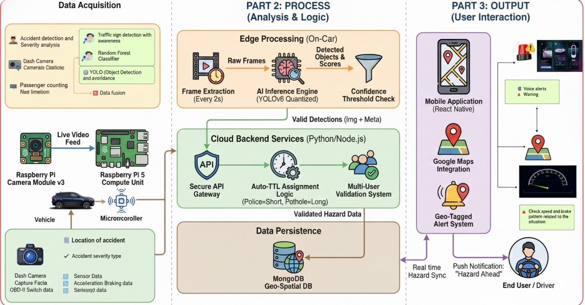

# ANZEN 🚗🛡️

**ANZEN** is an AI-powered intelligent road safety and accident prevention system designed to enhance driver safety and emergency response, with a strong focus on Sri Lankan road conditions. The system integrates edge AI, mobile technologies, cloud services, and real-time mapping to proactively detect hazards, analyze driver behavior, and respond intelligently during emergencies.

---

## 🔗 GitHub Repository

Frontend Repository:
👉 [https://github.com/lastprojectresearch/frontend.git](https://github.com/lastprojectresearch/frontend.git)

---

## 🏗️ System Architecture

The following diagram illustrates the end-to-end architecture of **ANZEN**, covering data acquisition, edge & cloud processing, and user interaction layers.

**High-Level Flow:**

* Vehicle-mounted sensors and dashcam collect real-time data
* Edge AI (Raspberry Pi) performs initial inference
* Validated detections are processed via cloud backend services
* Geo-spatial data is stored and synchronized
* Drivers receive real-time alerts through a React Native mobile application

---

## 🧩 Core System Components

### 1️⃣ Driver Behavior Analysis System

The **Driver Behavior Analysis** component evaluates both **driver facial expressions** and **driving patterns** using AI and machine learning techniques to identify risky behavior in real time.

**Key Features:**

* Facial analysis to detect:

  * Stress
  * Fatigue
  * Aggression
* Vehicle sensor analysis including:

  * Acceleration patterns
  * Braking intensity
  * Speed variation
* AI-based driving score calculation
* Real-time risk assessment
* Instant alerts and warnings via the mobile application

**Outcome:**
Promotes safer driving by notifying drivers when risky behavior is detected.

---

### 2️⃣ Road Safety & Traffic Awareness System

The **Road Safety Component** focuses on improving situational awareness by monitoring blind spots, blind bends, nearby objects, and traffic signs.

**Key Features:**

* Detection of nearby vehicles and obstacles
* Speed monitoring and comparison with speed limits
* Traffic sign recognition
* Context-aware voice alerts:

  * Warning alerts when danger is detected
  * Informational or safe-driving messages during normal conditions

**Outcome:**
Enhances driver awareness and reduces accident risk in complex road scenarios.

---

### 3️⃣ AI-Powered Road Hazard Detection & Map Update System

This component automates road hazard detection and mapping using **YOLOv8-based AI**, eliminating the need for manual user reporting.

Unlike crowd-sourced navigation apps, ANZEN detects hazards directly from **live dashcam footage**.

**Detected Hazards Include:**

* Police barriers
* Construction zones
* Road damage and potholes

**Key Capabilities:**

* **Live Hazard Mapping**
  Hazards are geo-tagged and displayed on a React Native map with three distinct color codes.

* **Smart Proximity Alerts**
  Automatic pop-up alerts when a driver approaches a detected hazard.

* **Interactive Hazard Details**
  Hazard pins display:

  * Hazard type
  * Distance from current location
  * Detection timestamp

* **Driver Feedback Loop**
  Users can:

  * *Ignore* alerts (filter false positives)
  * *Avoid* hazards (trigger re-routing)

* **Auto-TTL Management**
  Backend logic assigns automatic expiration times based on hazard type:

  * Short TTL → Police checks
  * Long TTL → Road damage

**Outcome:**
Provides an intelligent, self-updating hazard map for safer route planning.

---

### 4️⃣ Severity-Based Passenger-Aware Emergency Alert System

This research-driven component improves emergency response accuracy by analyzing **accident severity** and **passenger count**.

**Key Technologies:**

* Random Forest Classifier for accident severity prediction
* YOLO-based object detection for passenger counting
* Data fusion from:

  * Sensors
  * GPS
  * Dashcam feeds

**Key Capabilities:**

* Context-aware emergency alerts
* Accurate accident severity classification
* Passenger-aware emergency notifications

**Project Status:**

* 🚧 **50% Complete**
* Core logic successfully simulated
* Ongoing challenges:

  * Hardware constraints
  * Low-light image detection

**Future Work:**

* Deployment on Raspberry Pi edge devices
* Full real-time vehicle integration

---

## 📱 Technology Stack (Overview)

* **Mobile App:** React Native
* **Edge AI:** Raspberry Pi, YOLOv8 (Quantized)
* **Backend:** Python / Node.js
* **Database:** MongoDB (Geo-Spatial)
* **Mapping:** Google Maps API
* **AI/ML:** YOLOv8, Random Forest, Computer Vision

---

## 🎓 Academic Context

ANZEN is developed as a **final-year research project**, focusing on practical AI applications for intelligent transportation systems tailored to Sri Lankan road conditions.

---

## 🚀 Vision

ANZEN aims to reduce road accidents, improve driver awareness, and enable faster emergency response through **AI-driven automation and real-time intelligence**.

---

*© 2026 – ANZEN Research Project*
